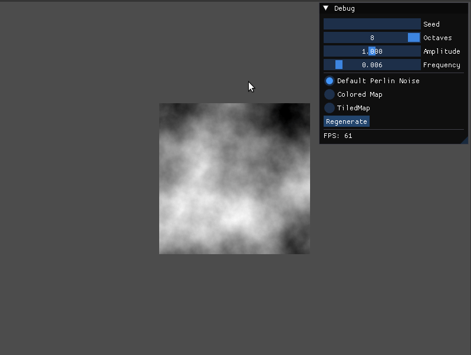
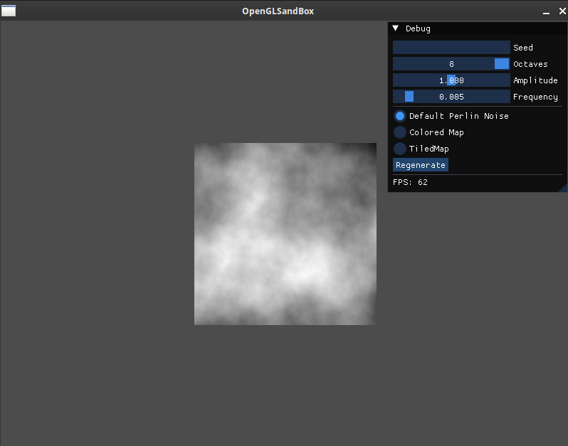
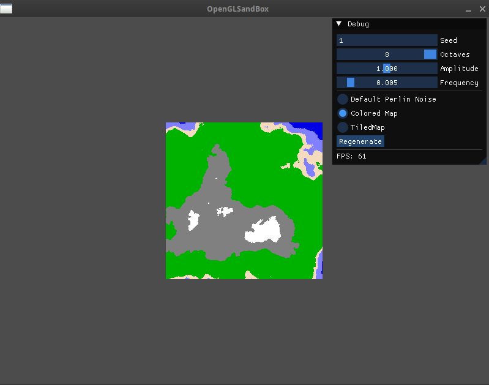
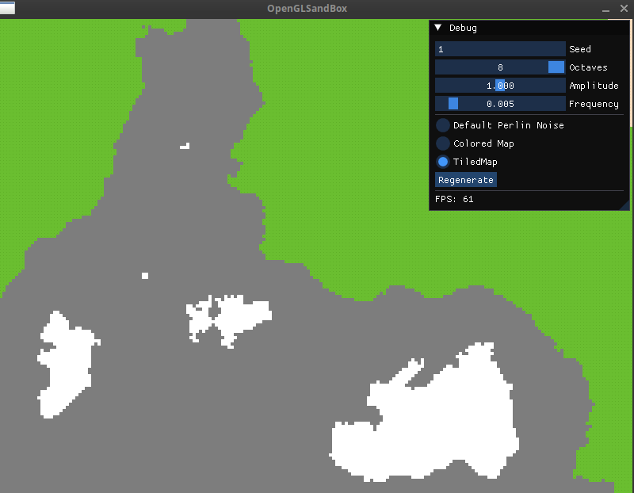

# 2D World Generator



A sandbox application written in C++ and OpenGL that procedurally generates 2D maps using Perlin Noise. This project allows for dynamic customization of generation parameters and real-time exploration with a movable camera.

## Features

- **Procedural Map Generation:** Creates worlds based on the Perlin Noise algorithm.
- **Multiple Map Modes:**
  - **Default Map:** A grayscale visualization of the noise values.
  - **Colored Map:** A colored pixel map representing different biomes.
  - **Tiled Map:** A map rendered with texture tiles for different terrain types.
- **Dynamic Camera:**
  - **Movement:** Full camera control with `WASD`.
  - **Acceleration:** Speed up movement with `Shift`.
  - **Smart Zoom:** Zoom in and out based on the mouse cursor's position using the scroll wheel.
- **Real-Time Configuration:** An intuitive ImGui interface to tweak generation parameters on the fly:
  - Seed
  - Octaves
  - Amplitude
  - Frequency

## Demo

| Default Map | Colored Map | Tiled Map |
| :---: | :---: | :---: |
|  |  |  |

## Technologies Used

- **Language:** C++ 14
- **Graphics API:** OpenGL 4.2
- **Libraries:**
  - **GLFW:** For window and input management.
  - **GLAD:** To load OpenGL function pointers.
  - **GLM:** For mathematics (vectors, matrices).
  - **ImGui:** For the user interface (`docking` branch).
  - **stb_image:** For loading textures.
- **Build System:** CMake

## Project Structure

```
2DWorldGenerator/
├── CMakeLists.txt
├── include/              # Header files (.h)
│   ├── Camera.h
│   └── ...
├── src/                  # Source files (.cpp)
│   ├── main.cpp
│   └── ...
├── res/                  # Resources
│   ├── assets/           # Textures (.png)
│   └── shaders/          # GLSL shaders (.vs, .fs)
├── vendors/              # Third-party libraries (GLAD, GLM, stb)
├── .gitignore
└── README.md
```

## Getting Started

### Prerequisites

- A C++ compiler that supports C++ 14.
- [CMake](https://cmake.org/download/) (version 3.28.3 or higher).
- An IDE that supports CMake, such as Visual Studio, CLion, or VS Code with the CMake Tools extension.

### Build Instructions

This project uses CMake to handle dependencies and build configurations. The ImGui library is fetched automatically during the CMake configuration step.

1.  **Clone the repository:**
    ```bash
    git clone https://github.com/YOUR_USERNAME/2DWorldGenerator.git
    cd 2DWorldGenerator
    ```

2.  **Configure the project using CMake:**
    ```bash
    # Create a build directory
    cmake -S . -B build

    # (For Visual Studio users, this will generate a .sln file inside the build folder)
    ```

3.  **Build the project:**
    ```bash
    cmake --build build
    ```
    Alternatively, open the generated solution (`.sln`) or project in your IDE and build from there.

4.  **Run the executable:**
    The final executable will be located in the `build` directory.

## License

This project is licensed under the MIT License. See the [LICENSE](LICENSE) file for details.
